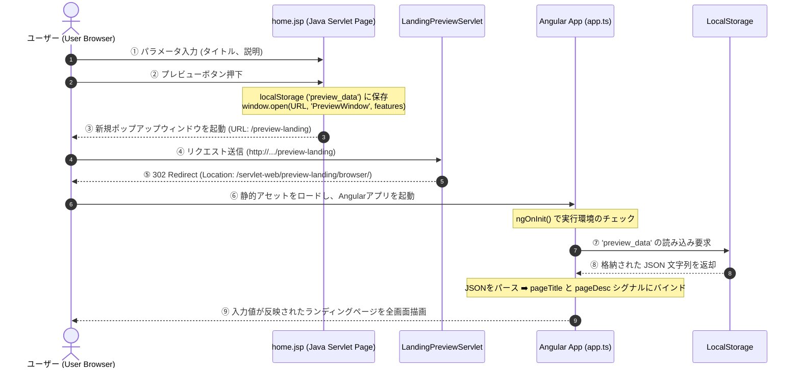

# WEB画面プレビュー機能 詳細設計書 (独立ランディングページ版)

---

## 1. 改訂履歴

| バージョン | 改訂日 | 作成者 | 改訂内容 |
|:---|:---|:---|:---|
| 1.0.0 | 2026/07/06 | Antigravity | 新規作成 (日本語版 詳細設計書) |
| 1.1.0 | 2026/07/07 | Antigravity | 設計を100%独立したランディングページプレビュー（Standalone Landing Page Preview）へ全面移行 |

---

## 2. 機能概要

本機能は、Java Servlet環境（オフライン環境）において、完全に独立したランディングページの画面プレビュー（Standalone Landing Page Preview）を提供するものである。

* ユーザーがサーブレット画面（`home.jsp`）からタイトルおよび説明を入力する。
* 「プレビュー」ボタンを押下すると、入力データはブラウザの `localStorage` にJSON形式で保存され、`window.open` を介して画面中央にポップアップウィンドウが開く。
* ポップアップウィンドウでは、Angularのサブプロジェクトとしてビルdされた独立アプリ `landing-preview` のみが読み込まれる。サイドバーやナビгеーションなどの枠組みは一切含まれない。
* ビルド後のファイルサイズはわずか **~107KB** であり、完全なコード分離によりオフラインでの読み込み速度を最大化している。

---

## 3. 構成ファイル一覧

本機能を実現するためのファイル構成は以下の通りである。

| No. | 物理パス | 区分 | 説明 |
|:---:|:---|:---:|:---|
| **1** | `servlet-web/src/main/webapp/home.jsp` | 画面 (JSP) | パラメータ（タイトル、説明）の入力フォームと、`localStorage` にデータを格納して `/preview-landing` を開くJavaScript。 |
| **2** | `servlet-web/src/main/java/com/example/web/LandingPreviewServlet.java` | Java (Servlet) | `/preview-landing` へのアクセスを受け取り、パラメータを維持して `/preview-landing/browser/` へ302リダイレクトを行う。 |
| **3** | `angular-app/projects/landing-preview/src/app/app.ts` | Angular (TypeScript) | 独立ランディングアプリのルートコンポーネント。`localStorage` からデータを復元し、シグナルへバインドする。 |
| **4** | `angular-app/projects/landing-preview/src/app/app.html` | Angular (View) | ランディングページのヒーロー、特徴グリッド、および問い合わせフォームを含むHTMLテンプレート。 |
| **5** | `angular-app/projects/landing-preview/src/styles.css` | Angular (CSS) | グラスモルフィズム、グローボタン、フォーム、およびアニメーションを含む独立したCSSスタイル定義。 |
| **6** | `angular-app/projects/landing-preview/src/index.html` | Angular (HTML) | オフライン環境でのローカルな相対パス解決のため、`<base href="./">` を設定したHTMLテンプレート。 |

---

## 4. 処理フロー ＆ シーケンス (Standalone Mode)

ユーザーがサーブレット上でデータを入力し、ポップアップで独立プレビュー画面を起動する際の流れである。



---

## 5. アクション・メソッド定義

### 5.1. Java Servlet側 (Backend)

#### ① `home.jsp` 内のプレビュー起動アクション
* **関数名**: `launchPreview()`
* **処理内容**:
  1. `<input id="previewTitle">` および `<input id="previewDesc">` の入力値を取得する。
  2. オブジェクトを `localStorage.setItem('preview_data', JSON.stringify(data))` を用いて保存する。
  3. 遷移先のURLを `${ctx}/preview-landing` に指定する。
  4. `window.open` を使用し、1200x800pxで画面中央にポップアップとして起動する。

#### ② `LandingPreviewServlet.java` でのリダイレクトとパラメータの伝播
* **処理コード**:
  ```java
  String queryString = req.getQueryString();
  String redirectUrl = contextPath + "/preview-landing/browser/";
  if (queryString != null && !queryString.isEmpty()) {
      redirectUrl += "?" + queryString;
  }
  resp.sendRedirect(redirectUrl);
  ```

---

### 5.2. Angular側 (独立ランディングアプリ)

#### ① データの復元 ＆ バインド ([app.ts](file:///Users/thucduy/Public/dev/java-servlet/angular-app/projects/landing-preview/src/app/app.ts))
* **処理フロー (`ngOnInit()`)**:
  ```typescript
  if (typeof window !== 'undefined') {
    // 1. localStorage からのデータ復元（最優先）
    const rawData = localStorage.getItem('preview_data');
    if (rawData) {
      try {
        const data = JSON.parse(rawData);
        if (data.title) this.pageTitle.set(data.title);
        if (data.desc) this.pageDesc.set(data.desc);
        return;
      } catch (e) {
        console.error('Error parsing preview_data from localStorage', e);
      }
    }

    // 2. フォールバック: URL クエリパラメータからの復元
    const params = new URLSearchParams(window.location.search);
    const title = params.get('title');
    const desc = params.get('desc');
    if (title) this.pageTitle.set(title);
    if (desc) this.pageDesc.set(desc);
  }
  ```
