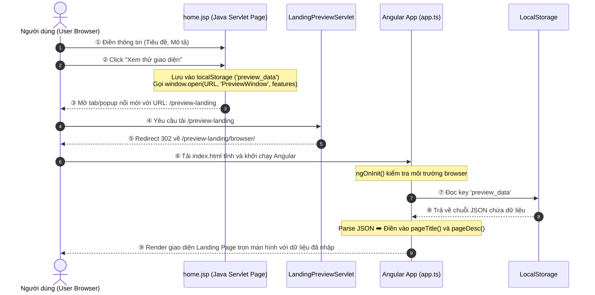

# TÀI LIỆU THIẾT KẾ CHI TIẾT TÍNH NĂNG XEM TRƯỚC TRANG WEB (PREVIEW LANDING STANDALONE)

---

## 1. Nhật ký Thay đổi

| Phiên bản | Ngày sửa đổi | Người thực hiện | Nội dung thay đổi |
|:---|:---|:---|:---|
| 1.0.0 | 2026/07/06 | Antigravity | Khởi tạo tài liệu thiết kế chi tiết (Bản tiếng Việt) |
| 1.1.0 | 2026/07/07 | Antigravity | Bọc tách hoàn toàn và chuyển đổi sang thiết kế Xem thử độc lập 100% (Standalone Landing Page Preview) |

---

## 2. Tổng quan Tính năng

Tính năng này cung cấp khả năng xem thử giao diện Landing Page tĩnh độc lập (Standalone Landing Page Preview) chạy ngoại tuyến (offline) trên Java Servlet Tomcat:
* Người dùng nhập thông tin tiêu đề và mô tả từ trang Servlet (`home.jsp`).
* Khi nhấn nút xem thử, trình duyệt lưu thông tin vào `localStorage` dưới định dạng JSON và kích hoạt hàm `window.open` mở ra một popup nổi độc lập.
* Popup này chỉ chứa duy nhất ứng dụng `landing-preview` (đầu ra của Angular sub-project), hoàn toàn không chứa sidebar điều hướng, không chứa các màn hình thừa khác.
* Dung lượng gói build cực kỳ gọn nhẹ (~107KB), giúp tải cực nhanh và hoạt động độc lập 100%.

---

## 3. Danh sách các File Cấu hình & Mã nguồn

Dưới đây là các file tham gia vào quá trình vận hành tính năng xem thử Landing độc lập:

| STT | Đường dẫn vật lý | Phân loại | Mô tả chi tiết |
|:---:|:---|:---:|:---|
| **1** | `servlet-web/src/main/webapp/home.jsp` | View (JSP) | Chứa bảng cấu hình nhập liệu (Title, Description) và mã javascript lưu `localStorage` rồi mở cửa sổ mới bằng `window.open` trỏ tới `/preview-landing`. |
| **2** | `servlet-web/src/main/java/com/example/web/LandingPreviewServlet.java` | Java (Servlet) | Đón nhận `/preview-landing`, bảo toàn tham số Query Parameter (nếu có) và thực hiện redirect 302 sang `/preview-landing/browser/`. |
| **3** | `angular-app/projects/landing-preview/src/app/app.ts` | Angular (TypeScript) | Controller gốc của trang Landing độc lập. Đọc `preview_data` từ `localStorage` trước, nếu trống sẽ đọc từ URL để đổ dữ liệu động lên Signals. |
| **4** | `angular-app/projects/landing-preview/src/app/app.html` | Angular (View) | HTML template chứa khung cấu trúc của trang Landing Page (Hero banner, Features grid, form contact). |
| **5** | `angular-app/projects/landing-preview/src/styles.css` | Angular (CSS) | Toàn bộ CSS variables, reset, và utility classes (.glass, .btn-glow) phục vụ riêng trang Landing. |
| **6** | `angular-app/projects/landing-preview/src/index.html` | Angular (HTML) | File index gốc thiết lập `<base href="./">` để nạp tương đối offline các file JS/CSS trong cùng thư mục. |

---

## 4. Sơ đồ Hoạt động & Định tuyến (Sequence Diagram)

Quy trình hoạt động khi người dùng cấu hình dữ liệu và mở xem thử độc lập trong cửa sổ mới:



---

## 5. Định nghĩa Action & Method

### 5.1. Phía Java Servlet (Backend & JSP)

#### ① Script lưu trữ & mở cửa sổ trong `home.jsp`
* **Hàm**: `launchPreview()`
* **Nội dung xử lý**:
  1. Đọc giá trị người dùng nhập tại các thẻ `<input id="previewTitle">` và `<input id="previewDesc">`.
  2. Tạo đối tượng JSON chứa dữ liệu và lưu vào `localStorage.setItem('preview_data', JSON.stringify(data))`.
  3. Xác định URL xem trước: `${ctx}/preview-landing`.
  4. Thực thi `window.open(url, 'PreviewWindow', features)` để mở popup nổi kích thước 1200x800px căn giữa màn hình.

#### ② Xử lý redirect trong `LandingPreviewServlet.java`
* **Mã xử lý**:
  ```java
  String queryString = req.getQueryString();
  String redirectUrl = contextPath + "/preview-landing/browser/";
  if (queryString != null && !queryString.isEmpty()) {
      redirectUrl += "?" + queryString;
  }
  resp.sendRedirect(redirectUrl);
  ```

---

### 5.2. Phía Angular (Client-side)

#### ① Nhập và đổ dữ liệu động tại Root Component ([app.ts](file:///Users/thucduy/Public/dev/java-servlet/angular-app/projects/landing-preview/src/app/app.ts))
* **Mã xử lý trong `ngOnInit()`**:
  ```typescript
  if (typeof window !== 'undefined') {
    // 1. Đọc dữ liệu từ localStorage trước (Ưu tiên chính)
    const rawData = localStorage.getItem('preview_data');
    if (rawData) {
      try {
        const data = JSON.parse(rawData);
        if (data.title) this.pageTitle.set(data.title);
        if (data.desc) this.pageDesc.set(data.desc);
        return;
      } catch (e) {
        console.error('Error parsing preview_data from localStorage', e);
      }
    }

    // 2. Dự phòng: Đọc từ URL Query Parameters nếu localStorage trống (Fallback)
    const params = new URLSearchParams(window.location.search);
    const title = params.get('title');
    const desc = params.get('desc');
    if (title) this.pageTitle.set(title);
    if (desc) this.pageDesc.set(desc);
  }
  ```
